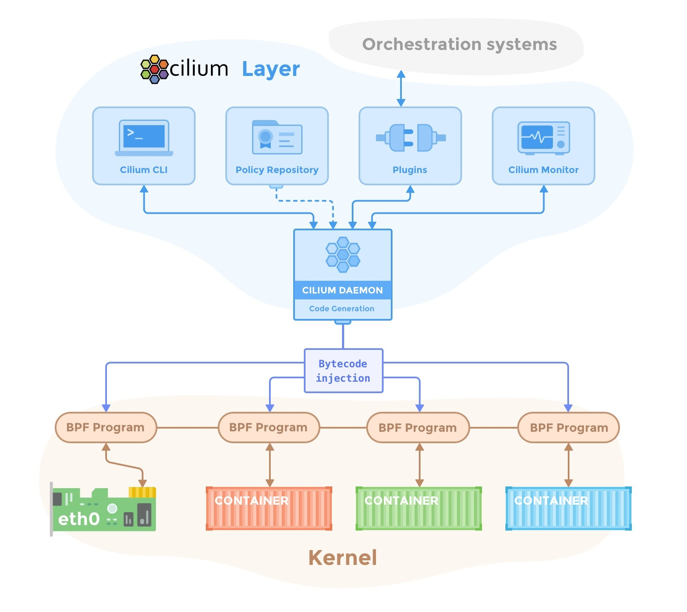
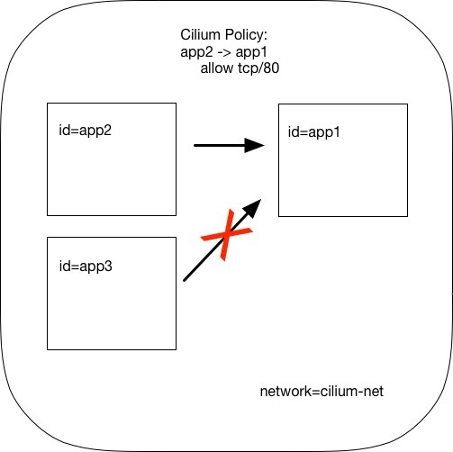

# Cilium架构设计与概念解析

Cilium 要求 Linux kernel 版本在 4.8.0 以上，Cilium 官方建议 kernel 版本至少在 4.9.17 以上，高版本的 Ubuntu 发行版中 Linux 内核版本一般在 4.12 以上，如使用 CentOS7 需要升级内核才能运行 Cilium。

KV 存储数据库用存储以下状态：

- 策略身份，Label 列表 <=> 服务身份标识
- 全局的服务 ID，与 VIP 相关联（可选）
- 封装的 VTEP（Vxlan Tunnel End Point）映射（可选）

为了简单起见，Cilium 一般跟容器编排调度器使用同一个 KV 存储数据库，例如在 Kubernetes 中使用 etcd 存储。

## 组成

下图是 Cilium 的组件示意图，Cilium 是位于 Linux kernel 与容器编排系统的中间层。向上可以为容器配置网络，向下可以向 Linux 内核生成 BPF 程序来控制容器的安全性和转发行为。



管理员通过 Cilium CLI 配置策略信息，这些策略信息将存储在 KV 数据库里，Cilium 使用插件（如 CNI）与容器编排调度系统交互，来实现容器间的联网和容器分配 IP 地址分配，同时 Cilium 还可以获得容器的各种元数据和流量信息，提供监控 API。

**Cilium Agent**

Cilium Agent 作为守护进程运行在每个节点上，与容器运行时如 Docker，和容器编排系统交互如 Kubernetes。通常是使用插件的形式（如 Docker plugin）或遵从容器编排标准定义的网络接口（如 [CNI](https://jimmysong.io/kubernetes-handbook/concepts/cni.html)）。

Cilium Agent 的功能有：

- 暴露 API 给运维和安全团队，可以配置容器间的通信策略。还可以通过这些 API 获取网络监控数据。
- 收集容器的元数据，例如 Pod 的 Label，可用于 Cilium 安全策略里的 Endpoint 识别，这个跟 Kubernetes 中的 service 里的 Endpoint 类似。
- 与容器管理平台的网络插件交互，实现 IPAM 的功能，用于给容器分配 IP 地址，该功能与 [flannel](https://jimmysong.io/kubernetes-handbook/concepts/flannel.html)、[calico](https://jimmysong.io/kubernetes-handbook/concepts/calico.html) 网络插件类似。
- 将其有关容器标识和地址的知识与已配置的安全性和可见性策略相结合，生成高效的 BPF 程序，用于控制容器的网络转发和安全行为。
- 使用 clang/LLVM 将 BPF 程序编译为字节码，在容器的虚拟以太网设备中的所有数据包上执行，并将它们传递给 Linux 内核。

## 命令行工具

Cilium 提供了管理命令行管理工具，可以与 Cilium Agent API 交互。`cilium` 命令使用方式如下。

```bash
Usage:
  cilium [command]

Available Commands:
  bpf                      直接访问本地 BPF map
  cleanup                  重置 agent 状态
  completion               bash 自动补全
  config                   Cilium 配置选项
  debuginfo                从 agent 请求可用的调试信息
  endpoint                 管理 endpoint
  identity                 管理安全身份
  kvstore                  直接访问 kvstore
  map                      访问 BPF map
  monitor                  显示 BPF 程序事件
  node                     管理集群节点
  policy                   管理安全策略
  prefilter                管理 XDP CIDR filter
  service                  管理 service & loadbalancer
  status                   显示 daemon 的状态
  version                  打印版本信息
```

详细使用情况请参考 [Cilium Command Cheatsheet](https://cilium.readthedocs.io/en/stable/cheatsheet/)。

## 策略控制示例

使用 docker-compose 安装测试，需要先用 vagrant 启动虚拟机，使用的是 Ubuntu-17.10 的 vagrant box。在下面的示例中，Cilium 是使用 docker network plugin 的方式部署的。Cilium 的一项主要功能——为容器创建网络，使用 `docker inspect` 来查询使用 Cilium 网络的容器配置，可以看到 Cilium 创建的容器网络示例如下。

```json
            "Networks": {
                "cilium-net": {
                    "IPAMConfig": null,
                    "Links": null,
                    "Aliases": [
                        "a08e52d13a38"
                    ],
                    "NetworkID": "c4cc3ac444f3c494beb1355e4a9c4bc474d9a84288ceb2030513e8406cdf4e9b",
                    "EndpointID": "2e3e4486525c20fc516d0a9d1c52f84edf9a000f3068803780e23b4c6a1ca3ed",
                    "Gateway": "",
                    "IPAddress": "10.15.125.240",
                    "IPPrefixLen": 32,
                    "IPv6Gateway": "f00d::a0f:0:0:1",
                    "GlobalIPv6Address": "f00d::a0f:0:0:ed50",
                    "GlobalIPv6PrefixLen": 128,
                    "MacAddress": "",
                    "DriverOpts": null
                }
            }
```

- **NetworkID**：每个网络平面的唯一标识
- **EndpointID**：每个容器/Pod 的在网络中的唯一标识

在 docker-compose 安装方式的[快速开始指南](https://cilium.readthedocs.io/en/stable/gettingstarted/docker/)中，演示了如何使用 Label 来选择容器，从而限制两个容器（应用）之间的流量访问权限的。

策略使用 JSON 格式配置，例如[官方示例](https://cilium.readthedocs.io/en/stable/gettingstarted/docker/)使用 Cilium 直接在 L3/L4 层管理容器间访问策略的方式。例如下面的策略配置具有 `id=app2` 标签的容器可以使用 TCP 协议、80 端口访问具有标签 `id=app1` 标签的容器。

```json
[{
    "labels": [{"key": "name", "value": "l3-rule"}],
    "endpointSelector": {"matchLabels":{"id":"app1"}},
    "ingress": [{
        "fromEndpoints": [
            {"matchLabels":{"id":"app2"}}
        ],
        "toPorts": [{
                "ports": [{"port": "80", "protocol": "TCP"}]
        }]
    }]
}]
```

将该配置保存成 JSON 文件，在使用 `cilium policy import` 命令即可应用到 Cilium 网络中。



如图所示，此时 `id` 标签为其他值的容器就无法访问 `id=app1` 容器，策略配置中的 `toPorts` 中还可以配置 HTTP `method` 和 `path`，实现更细粒度的访问策略控制。

## 参考

- [Cilium Concepts - docs.cilium.io](https://docs.cilium.io/en/stable/concepts/)
- [Getting Started Guides - docs.cilium.io](https://docs.cilium.io/en/v1.11/gettingstarted/#getting-started-guides)
