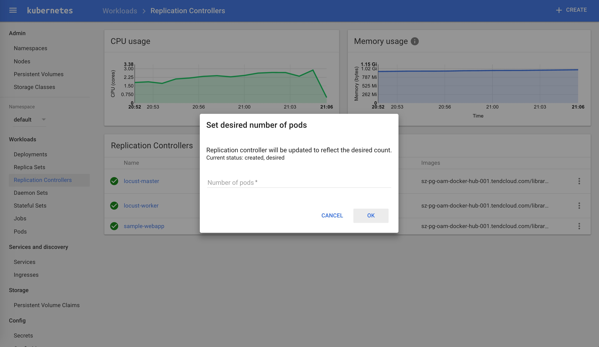
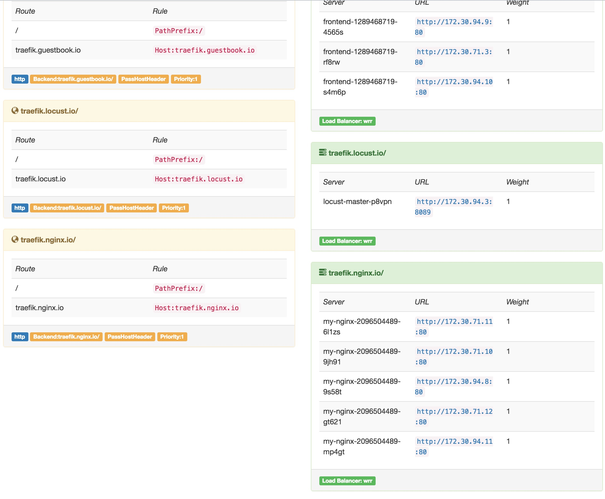
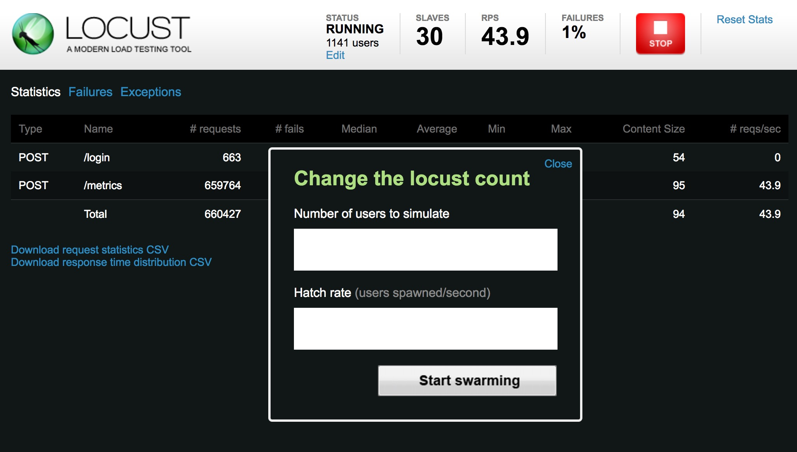
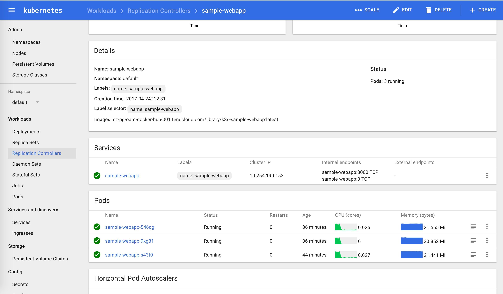
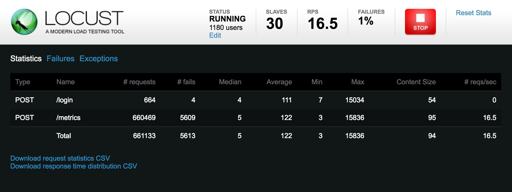

## 分布式负载测试

该教程描述如何在 [Kubernetes](https://kubernetes.io/) 中进行分布式负载均衡测试，包括一个 web 应用、docker 镜像和 Kubernetes controllers/services。关于分布式负载测试的更多资料请查看 [Distributed Load Testing Using Kubernetes](https://cloud.google.com/solutions/distributed-load-testing-using-kubernetes) 。

## 准备

不需要 GCE 及其他组件，你只需要有一个 kubernetes 集群即可。

## 部署 Web 应用

本文中使用的镜像、kubernetes 应用的 yaml 配置来自我的另一个项目，请参考 [GitHub](https://github.com/rootsongjc/distributed-load-testing-using-kubernetes)。

`sample-webapp` 目录下包含一个简单的 web 测试应用。我们将其构建为 docker 镜像，在 kubernetes 中运行。

在 kubernetes 上部署 sample-webapp。

```bash
$ git clone https://github.com/rootsongjc/distributed-load-testing-using-kubernetes.git
$ cd kubernetes-config
$ kubectl create -f sample-webapp-controller.yaml
$ kubectl create -f sample-webapp-service.yaml
```

## 部署 Locust 的 Controller 和 Service

`locust-master` 和 `locust-work` 使用同样的 docker 镜像，修改 cotnroller 中 `spec.template.spec.containers.env` 字段中的 value 为你 `sample-webapp` service 的名字。

```yaml
- name: TARGET_HOST
  value: http://sample-webapp:8000
```

### 创建 Controller Docker 镜像（可选）

`locust-master` 和 `locust-work` controller 使用的都是 `locust-tasks` docker 镜像。你可以直接下载 `gcr.io/cloud-solutions-images/locust-tasks`，也可以自己编译。自己编译大概要花几分钟时间，镜像大小为 820M。

```bash
$ docker build -t jimmysong/locust-tasks:latest .
$ docker push jimmysong/locust-tasks:latest
```

每个 controller 的 yaml 的 `spec.template.spec.containers.image` 字段指定的是我的镜像：

```ini
image: jimmysong/locust-tasks:latest
```

### 部署 locust-master

```bash
$ kubectl create -f locust-master-controller.yaml
$ kubectl create -f locust-master-service.yaml
```

### 部署 locust-worker

Now deploy `locust-worker-controller`:

```bash
$ kubectl create -f locust-worker-controller.yaml
```

你可以很轻易的给 work 扩容，通过命令行方式：

```bash
$ kubectl scale --replicas=20 replicationcontrollers locust-worker
```

当然你也可以通过 WebUI：Dashboard - Workloads - Replication Controllers - **ServiceName** - Scale 来扩容。



### 配置Traefik

参考 [Kubernetes 的 traefik ingress 安装](https://jimmysong.io/posts/traefik-ingress-installation/)，在 `ingress.yaml` 中加入如下配置：

```yaml
  - host: traefik.locust.io
    http:
      paths:
      - path: /
        backend:
          serviceName: locust-master
          servicePort: 8089
```

然后执行 `kubectl replace -f ingress.yaml` 即可更新 traefik。

通过 Traefik 的 dashboard 就可以看到刚增加的 `traefik.locust.io` 节点。



## 执行测试

打开 `http://traefik.locust.io` 页面，点击 `Edit` 输入伪造的用户数和用户每秒发送的请求个数，点击 `Start Swarming` 就可以开始测试了。



在测试过程中调整 `sample-webapp` 的 pod 个数（默认设置了 1 个 pod），观察 pod 的负载变化情况。



从一段时间的观察中可以看到负载被平均分配给了 3 个 pod。

在 locust 的页面中可以实时观察也可以下载测试结果。



