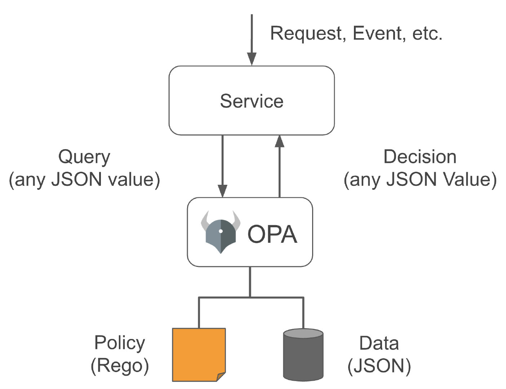

# OPA（开放策略代理）

OPA，全称 Open Policy Agent（开放策略代理），2016 年开源，目前已是 CNCF 中的毕业项目。官网是 [openpolicyagent.org](https://www.openpolicyagent.org/)。

## OPA 简介

由于在云原生应用平台中，缺乏一个可以在不同系统和平台之间使用的中央授权系统，导致了许多问题。例如，API 可能有自己的授权逻辑内置于代码中，其他微服务可能依赖于一个或多个外部授权系统。Kubernetes 中可以使用 RBAC 为应用授权，但是在 Kubernetes 集群之外又鞭长莫及。这使得推出新的策略，检查现有策略的版本，甚至引入小的变化都是非常具有挑战性。

OPA 主要为了解决云原生应用的访问控制、授权和策略。OPA 是通用的，与平台无关。因此，在发送查询或定义输出的样子时，你不需要遵循任何规则。请求和响应是以 JSON 格式发送的。

## OPA 原理

OPA将决策与策略执行解耦。当你的软件需要做出决策时，它查询 OPA 并提供结构化数据（例如，JSON）作为输入。OPA 接受任意的结构化数据作为输入。其原理如下图所示。

OPA 通过评估查询输入并对照策略和数据来生成决策。OPA 和 Rego 是不分领域的，所以你可以在策略中描述几乎任何事件。比如：

- 哪些用户可以访问哪些资源。
- 哪些子网允许出口流量进入。
- 工作负载必须部署到哪个集群。
- 哪些注册表可以下载二进制文件。
- 容器可以用哪些操作系统的能力来执行。
- 系统在一天中的哪些时间可以被访问。
- 政策决定不限于简单的是/否或允许/拒绝的答案。像查询输入一样，你的策略可以生成任意的结构化数据作为输出。

OPA 的策略可以用 Rego 编写，这是一种专门为 OPA 设计的语言。类似于 JavaScript，OPA 使其非常容易将规则转换为有效的 OPA 策略。

## 参考

- [策略即代码 —— Open Policy Agent（开放策略代理 O P A）简介 - cloudnative.to](https://cloudnative.to/blog/introducing-policy-as-code-the-open-policy-agent-opa/)